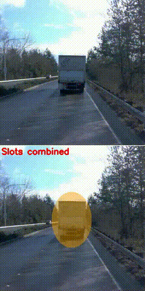
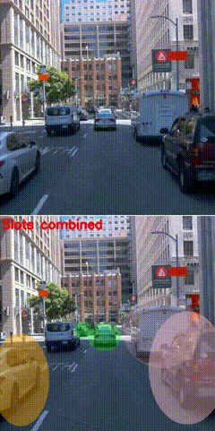
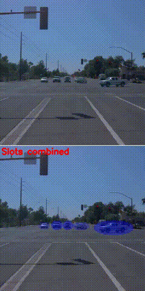
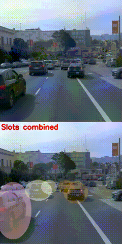
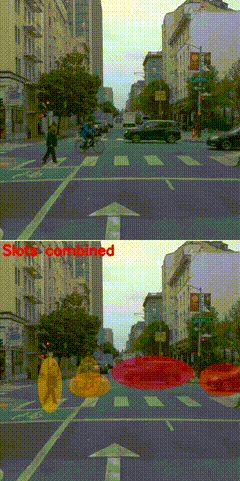
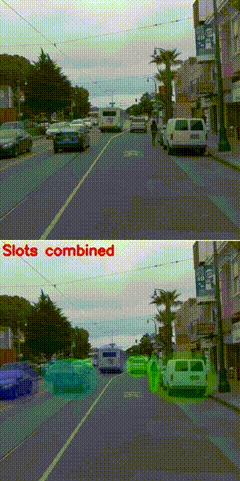

## Description

This repository is aimed at bridging the gap of leveraging object centric learning **from** *generic object classes in synthetic datasets* **to** *application specific, targeted detection (road users) in autonomous driving datasets*. Specifically, we focus on leveraging slot-attention based object centric learning to filter nearby road users, based on detected cues of proximity and motion. The motivation for the work originates from the model developed in [1], and evaluating its viability to filter high-priority road user via scene decomposition + object discovery in various autonomous driving settings. 

<table>
  <tr>
    <td>
      
    </td>
    <td>
      
    </td>
    <td>
      
    </td>
  </tr>
  <tr>
    <td>
      
    </td>
    <td>
      
    </td>
    <td>
      
    </td>
  </tr>
</table>


## Pre-requisites for execution

- **For dataset preparation, refer to the Waymo [2] sub-section of the repo here: https://github.com/nilushacj/Slot-attention-SAVi-adapt**

- Create the virtual environment for installing the required libraries and dependencies using the provided **requirements.yml** file. 

- Download the checkpoints file into the **checkpoints** directory via the following link: https://drive.google.com/file/d/1vjx20_ztkzZ4nmURBP4iChRCNYz9MAk8/view?usp=sharing 


## Execution

- Refer to all instances of **TODO** in the *inference_unsupervised.sh*, *inference_unsupervised.py*, *waymo_tfds.yml*, and *inference_ru_slots.py* files to change the input/output paths as required.

- Execute the bash file for generating the unsupervised slots (scene decomposition)
```bash
sbatch inference_unsupervised.sh
```

- Run the script to generated the filtered road user slots:
```bash
sbatch inference_ru_slots.sh
```


## Other notes

- The current setup in the bash files are made to be compatible with SBATCH since the execution was carried out in an HPC (high-performance computing cluster): https://scicomp.aalto.fi/triton/


## References:

1. Zadaianchuk, A., Seitzer, M., & Martius, G. (2023). Object-centric learning for real-world videos by predicting temporal feature similarities. Advances in Neural Information Processing Systems, 36, 61514-61545.

2. Sun, P., Kretzschmar, H., Dotiwalla, X., Chouard, A., Patnaik, V., Tsui, P., Guo, J., Zhou, Y., Chai, Y., Caine, B., et al. (2020). Scalability in perception for autonomous driving: Waymo open dataset. In *Proceedings of the IEEE/CVF Conference on Computer Vision and Pattern Recognition* (pp. 2446–2454).

## License
This repository is licensed under the MIT License. See the [LICENSE](LICENSE) file for details.